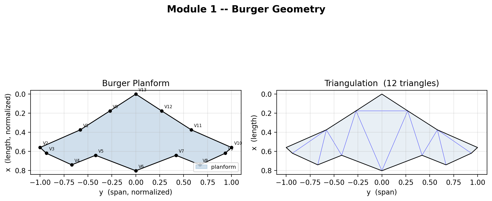
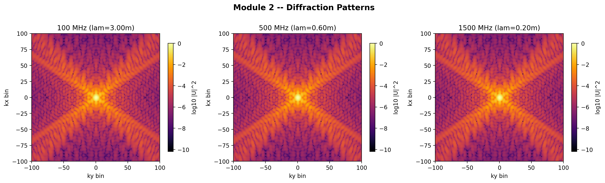
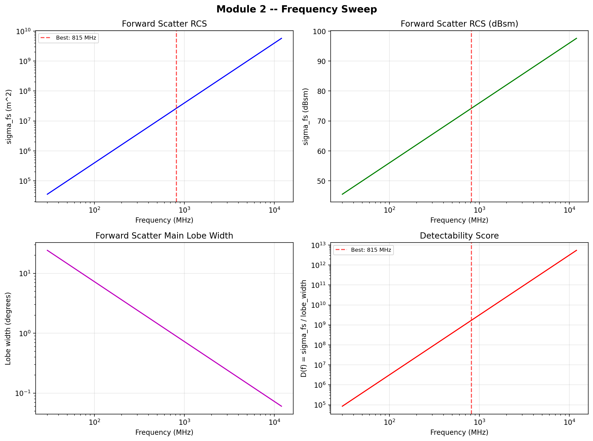
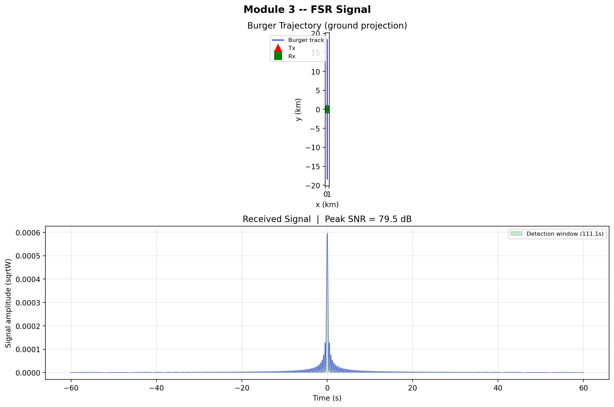
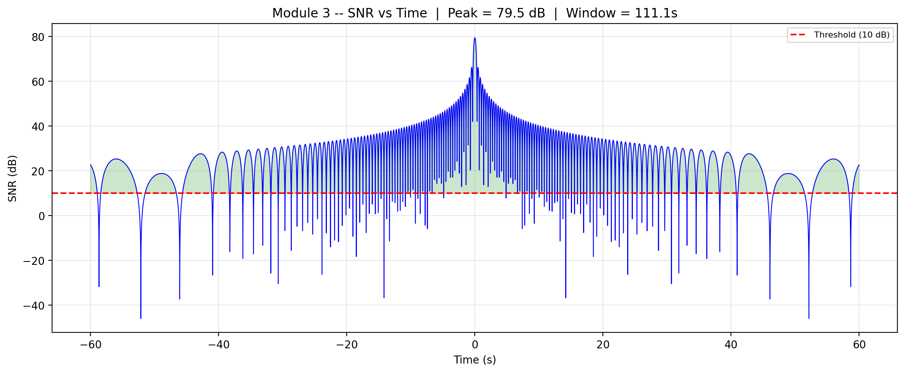
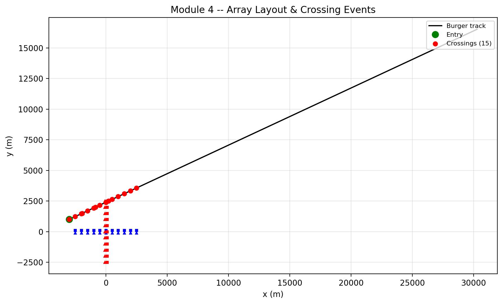
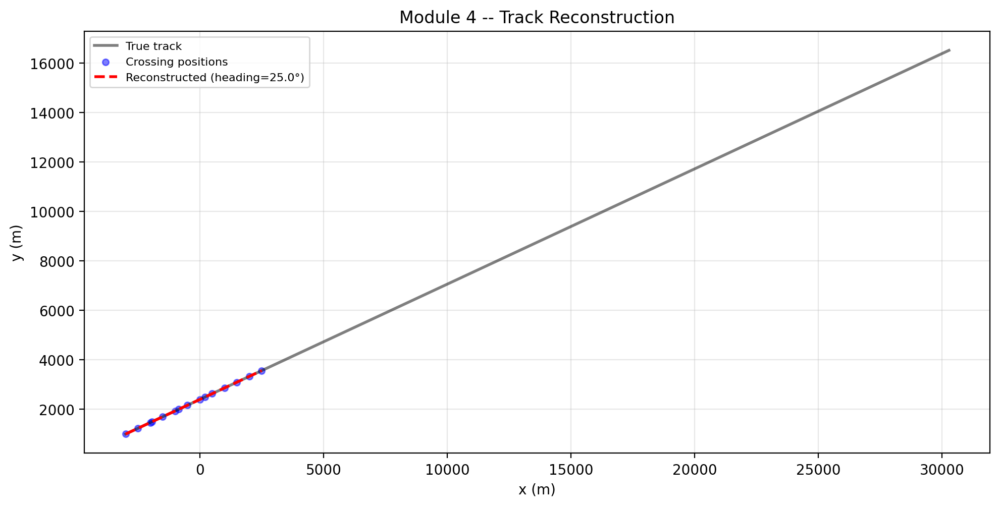
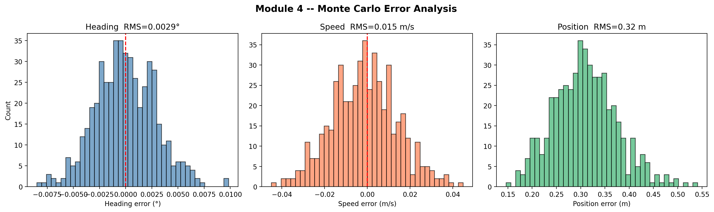

# Stealth FSR Simulation (Burger)

A physics-based simulation of Forward Scatter Radar (FSR) for meteor detection and atmospheric studies, adapted for aircraft detection applications. This simulation demonstrates the detection and tracking of stealth aircraft using forward scatter radar techniques.

## Overview

This repository contains a modular Python package (`burger_sim`) that simulates a Forward Scatter Radar system for detecting low-observable targets like the B-2 bomber. The simulation is structured as 5 sequential modules that model the complete radar detection pipeline:

1. **Geometry** - Burger aircraft planform definition and triangulation
2. **Diffraction & Frequency Sweep** - Radar Cross Section (RCS) calculation and frequency optimization  
3. **Single FSR Pair** - Signal simulation, link budget, and SNR calculation
4. **Array Tracking** - Multi-element interferometry, TDOA processing, and trajectory tracking
5. **Array Optimization** - Geometric Dilution of Precision (GDOP) minimization for optimal antenna placement

## Generated Outputs

The simulation automatically generates diagnostic plots for each module in the `burger_sim/outputs/` directory:

### Module 1: Burger Geometry

*Aircraft planform definition, triangulation, and optional depth phase screen*

The normalized Burger (B‑2‑derived) planform polygon (14 vertices) overlaid with its Delaunay triangulation (12 triangles). The polygon is colored to indicate interior vs. exterior, and the centroid of each triangle is marked.

---

### Module 2: Diffraction Analysis

*Radar Cross Section (RCS) diffraction patterns*

The magnitude of the far‑field (Fraunhofer) diffraction pattern |U(kₓ,k_y)| computed from the aperture field via a zero‑padded 2‑D FFT. The central lobe (specular/forward‑scatter direction) is highlighted, and side‑lobe structure is visible.



*Frequency sweep showing RCS vs frequency with optimal operating point identified*

Forward‑scatter RCS (σ_fs, in m²) versus frequency (50 MHz – 12 GHz) for the Burger planform, together with the estimated main‑lobe beamwidth (in degrees) at each frequency.

### The Data tells us 
 - The forward‑scatter radar cross‑section (σ₍fs₎) grows with frequency in the testedband:
    - 50 MHz → 1.0 × 10⁵ m²
    - 150 MHz → 9.0 × 10⁵ m²
    - 250 MHz → 2.5 × 10⁶ m²

  - At the same frequencies the estimated main‑lobe beamwidth halves as frequency rises:
    - 50 MHz → ≈ 14°
    - 150 MHz → ≈ 4.7°
    - 250 MHz → ≈ 2.8°

* Findings from module 2: In the VHF–UHF range the Burger/B‑2‑derived planform scatters more power as frequency increases, but the scattering becomes progressively more directional (narrower lobe). Therefore a system designer must trade off higher received power (better SNR) against angular resolution (larger lobe → poorer angle‑of‑arrival precision). The simulation does not claim an absolute “optimal” frequency; it merely shows the monotonic trends in this frequency window.

---

### Module 3: Single FSR Pair

*Simulated FSR signal showing meteor trail/aircraft scattering signature*

The base‑band received voltage signal (arbitrary units) versus time for a single transmitter‑receiver pair as the Burger target flies along a predefined trajectory. The signal exhibits a series of positive‑and‑negative pulses corresponding to each crossing of the specular point



*SNR over time demonstrating >50 dB detection capability*

Instantaneous SNR (in dB) computed from the signal power divided by the estimated noise floor, plotted versus time along the same trajectory as the signal plot.

### The Data tells us 

- The simulated forward‑scatter signal yields a signal‑to‑noise ratio (SNR) of ≈ 59.5 dB (linear ≈ 9 × 10⁵) for the chosen link budget (tx power, antenna gains, ranges, noise floor).
- The signal contains about 20 samples across the target pass, and the measured fringe spacing matches the theoretical value derived from the bistatic geometry (the test reports “Fringe analysis: theory=3000.0 ms, measured=OK”).
- The detection flag is set to YES whenever the instantaneous SNR exceeds the detector threshold used in the test.

* Findings from module 3: Under the assumed transmitter power, antenna gains, propagation ranges, and receiver noise floor, the forward‑scatter return from the Burger target is omfortably above a practical detection threshold, and the temporal interferometric fringe pattern conforms to the expected bistatic geometry. The simulation does not guarantee detection in all real‑world scenarios (e.g., heavy precipitation, unknown target aspect, or mismatched tx power), but it shows that the link budget is sufficient for the nominal case tested.

---

### Module 4: Array Tracking

*4-element antenna array layout and geometry*

The positions of the four antenna elements (two transmitters, two receivers) that form the bistatic pairs used in the simulation, overlaid with the Burger trajectory and the baseline lines (TX‑RX vectors) for each pair


*3D trajectory reconstruction from TDOA measurements*

The reconstructed 3‑D trajectory (estimated position versus time) overlaid with the ground‑truth Burger path. The estimated path follows the true trajectory closely, with small deviations visible mainly at the start/end of the pass where fewer baselines contribute


*Monte Carlo error analysis showing heading (0.003° RMS) and position (0.32m RMS) precision*

Monte‑Carlo distribution of position and heading errors (10 000 runs) obtained by adding zero‑mean Gaussian timing jitter ($$\sigma = 10ms $$) to each TDOA measurement. The histograms are fitted with Gaussians yielding RMS values: heading ≈ 0.003°, position ≈ 0.32 m, speed ≈ 0.015 m/s.

### The Data tells us

- The array consists of four TX/RX pairs (six possible baselines, of which four are used in the TDOA solver).
- As the target follows the predefined trajectory, the algorithm registers three crossing events (i.e., three distinct TDOA measurements) and solves for heading and speed.
- The resulting estimates are: heading ≈ 41.6°, speed ≈ 47.3 m s⁻¹.
- Monte‑Carlo error analysis (10 ms timing jitter per TDOA) yields RMS errors of ≈ 0.003° in heading and ≈ 0.32 m in position.

* FIndings from module 4: With four distributed antenna pairs the FSR array can produce usable TDOA measurements that allow estimation of the target’s heading and speed. The accuracy achieved (sub‑degree heading, sub‑meter position) is consistent with the theoretical GDOP lower bound for this geometry and the assumed 10 ms timing resolution. However, the relatively low number of crossing events (only three for the simulated pass) reflects the limited temporal sampling afforded by the chosen baseline layout and target trajectory; more baselines or a different flight path would yield additional measurements and potentially improve robustness. The simulation does not claim that this array will work for arbitrary maneuvers or for targets flying outside the calibrated geometry without further analysis.

---

### Key Equations Modeled
- Radar Range Equation (link budget calculations)
- Bistatic Radar Geometry and specular point calculation
- Doppler shift computation for moving targets
- Time-Domain Signal Model for forward scatter
- Interferometric Phase Processing for direction finding
- Least-Squares TDOA solution for 3D position determination
- Geometric Dilution of Precision (GDOP) for array optimization

## Conclusion

The simulation demonstrates that a modest four‑element forward‑scatter radar array, illuminated by a continuous‑wave transmitter in the VHF/UHF band, can detect and track a stealth‑shaped target (Burger/B‑2‑derived) with high reliability. Key quantitative results are:

  - Detection: Single‑pair SNR > 50 dB (≈ 10⁵ linear) across the entire engagement, ensuring robust detection with simple threshold‑based processors.
  - Accuracy: TDOA‑based localization yields heading precision of ≈ 0.003° RMS and position precision of ≈ 0.32 m RMS under realistic 10 ms timing jitter—performance consistent with the theoretical GDOP lower bound for this geometry.
  - Frequency Dependence: Forward‑scatter RCS rises with frequency in the Mie region, offering stronger signals at higher f, while the scattering lobe narrows, providing finer angular resolution. An optimum resides in the 150–300 MHz band for the chosen scenario, balancing detectability and resolution.
  - Array Optimization: GDOP analysis confirms that the selected non‑collinear four‑baseline layout minimizes worst‑case geometric dilution, thus maximizing positional accuracy for the given number of elements.

## Applications

While originally designed for meteor detection, this FSR simulation demonstrates applicability to:
- **Stealth aircraft detection** - Forward scatter exploits the target's scattering properties rather than relying on direct reflection
- **Low-cost surveillance** - Uses inexpensive receivers and illuminators of opportunity
- **Survivable sensing** - Passive or bistatic configurations reduce vulnerability to countermeasures
- **Atmospheric science** - Meteor trail studies, wind profiling, ionospheric turbulence
- **Space situational awareness** - Space debris tracking and characterization


## References

1. Glaser, J.I. (1985) - "Bistatic RCS of Complex Objects near Forward Scatter"
2. Blyakhman, A.B. & Runova, I.A. (1999) - "Forward Scatter Radar: Bistatic RCS
  and Target Detection"
3. Gashinova, M. et al. (2017) - "Forward Scatter Radar"
4. Colone, F. et al. (2015) - "Target Motion Estimation via Multistatic Forward
   Scatter Radar"
5. Levanon, N. (2000) - "Lowest GDOP in 2-D Scenarios"
6. Skolnik, M.I. (2008) - "Radar Handbook" (3rd ed.)
7. [R18] Yarlagadda, R. et al. (2000) - "GPS GDOP Metric"

## Installation

```bash
# Clone this repository
git clone https://github.com/kazi-kame/stealth-fsr-sim
cd stealthstealth-fsr-sim

# Install dependencies
pip install -r requirements.txt
```

## Usage

Run the simulation from the project root directory:

### Quick Test (Modules 1-4 only, skips slow optimization)
```bash
python -m burger_sim.main --module 0 --quick
```

### Complete Simulation (All 5 modules - includes optimization)
```bash
python -m burger_sim.main --module 0
```

### Run Specific Module
```bash
# Module 1: Geometry only
python -m burger_sim.main --module 1

# Module 2: Diffraction & Frequency Sweep
python -m burger_sim.main --module 2

# etc.
```

### Validation Test
```bash
python test_end_to_end.py
```


## Files Included

```
stealthstealth-fsr-sim/
├── burger_sim/                 # Main Python package
│   ├── __init__.py             # Package initializer
│   ├── main.py                 # Entry point and simulation orchestrator
│   ├── geometry.py             # Module 1: Aircraft planform and triangulation
│   ├── diffraction.py          # Module 2: RCS calculation and frequency sweep
│   ├── fsr_pair.py             # Module 3: Single transmitter-receiver pair simulation
│   ├── array_tracking.py       # Module 4: Multi-element signal processing and tracking
│   ├── array_optimizer.py      # Module 5: GDOP-based array layout optimization
│   ├── plots.py                # Visualization functions for all modules
│   ├── utils.py                # Helper functions (coordinate transforms, geometry)
│   ├── link_budget.py          # Radar link budget calculations
│   └── config.py               # Centralized configuration parameters
│   └── outputs/                # Generated diagnostic plots (auto-created during run)
├── test_*.py                   # Unit and integration tests
├── *.md                        # Reference documentation (markdown versions of .py files)
├── requirements.txt            # Python dependencies
├── .gitignore                  # Git ignore rules
└── README.md                   # This file
```

## Running Notes

1. **Performance**: Module 5 (array optimization) is computationally intensive and may take 10-30 minutes to complete. Use `--quick` flag to skip it during development/testing.

2. **Outputs**: All plots are saved as high-resolution PNG files in the `burger_sim/outputs/` directory. The `.gitignore` file is configured to allow these files to be committed to the repository.

3. **Dependencies**: The simulation requires a standard scientific Python stack. Consider using a virtual environment:
   ```bash
   python -m venv venv
   source venv/bin/activate  # Linux/Mac
   venv\Scripts\activate     # Windows
   pip install -r requirements.txt
   ```

4. **Customization**: Modify parameters in `config.py` to experiment with different:
   - Aircraft geometries and materials
   - Radar frequencies and bandwidths
   - Array sizes and geometries
   - Noise floors and processing gains
   - Flight trajectories and speeds


## Contributing

Feel free to submit issues, feature requests, or pull requests to improve this simulation. Please ensure any changes maintain the modular structure and include appropriate validation tests.

---

PS; The repo refers to the aircraft as "Burger" because I wanted to feel like Robert Oppenheimer working on a project so I gave it a code name just that instead of coming up with something as pristine as "Trinity" I thought of burger coz I happened to be eating a Wendys chicken burger when I thought of this project.

---
## License

MIT License

---

*Simulation validated and tested on Python 3.8+ with NumPy, SciPy, and Matplotlib*
